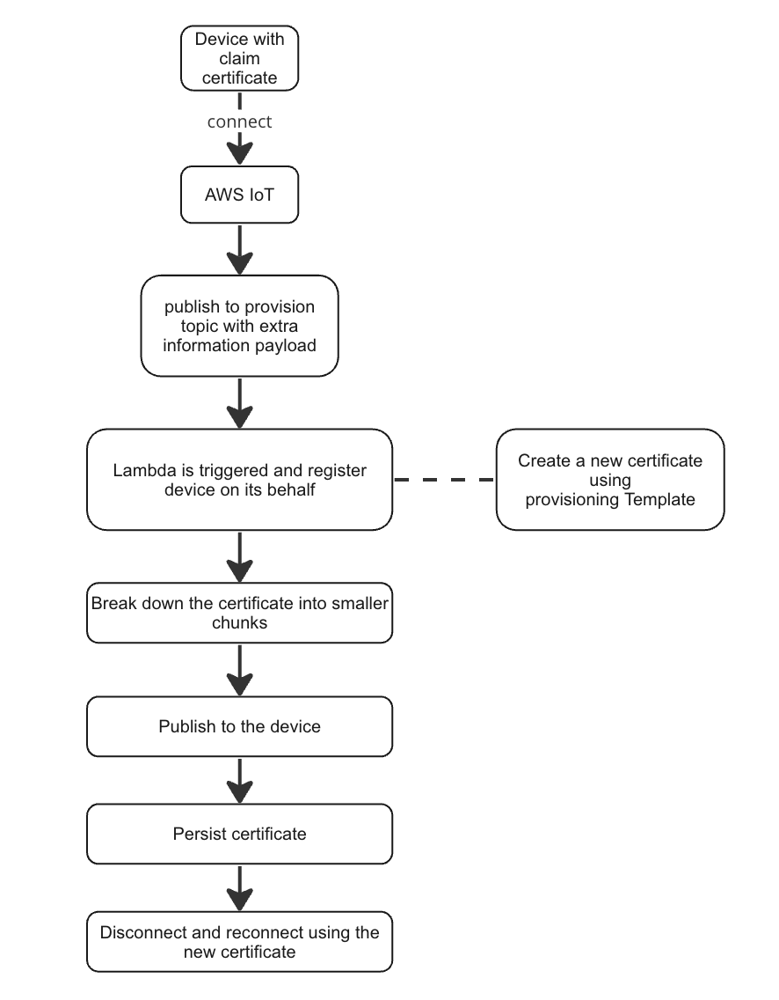

# Device Provisioning Using Claim Certificates and Lambda Function

[](https://github.com/semantic-release/semantic-release)
[](https://renovatebot.com)
[](http://commitizen.github.io/cz-cli/)
[](https://github.com/prettier/prettier/)
[](https://github.com/typescript-eslint/typescript-eslint)

## Introduction

This document explains the process of provisioning a device using claim
certificates and a Lambda function. This solution addresses the challenge of
dealing with certificate sizes that surpass the memory limitations of the device
within the AWS IoT ecosystem. It also provides a step-by-step guide on how to
set up the demo environment and run the simulation.

## Background

AWS IoT allows devices to securely connect to the cloud and exchange data
through various protocols such as MQTT, HTTP, and WebSocket. When a device
connects to AWS IoT, it needs to be registered and assigned a unique certificate
for secure communication. One way to accomplish this is by using claim
certificates, which are shared among multiple devices.

## Challenges

One challenge with using claim certificates is that the size of the issued
certificate might exceed the memory limit of the device. In such cases, we need
to find an alternative solution to register the device without exceeding the
memory limit.

## Solution

Our proposed solution is to use a Lambda function to register the device on
behalf of the device. The Lambda function can break down the received
certificate into smaller chunks and publish them to the device. This approach
ensures that the device can receive the certificate without exceeding its memory
limit.

## Flow Diagram

Here is a high-level flow diagram of the proposed solution:



## Steps

Here are the steps involved in setting up the demo environment and running the
simulation:

1. Create an AWS IoT message rule for a desired device provisioning topic to
   trigger the Lambda function.
1. Assign the process of registering the device to the Lambda function.
1. The device connects with a claim certificate to the AWS IoT endpoint.
1. The device publishes to the device provisioning topic with its ID and extra
   information used to create certificate.
1. The Lambda function registers the device based on the published information.
1. The Lambda function breaks down the received certificate into smaller chunks.
1. The Lambda function publishes the chunked certificate to the device.
1. The device stores the new certificate.
1. The device reconnects using the new certificate.

## Security Considerations

Securing the process of publishing a certificate back to the device via Lambda
involves careful considerations. To ensure controlled communication exclusively
between the Lambda function and the device, certain restrictions should be
implemented.

One of the primary steps involves crafting policies to manage the certificate
claiming process. These policies should grant the device specific permissions,
specifically enabling it to both publish and subscribe to a designated topic.
These permissions should be tied to the unique device ID. Formulating a policy
in line with these requirements would resemble the following:

```json
{
  "Version": "2012-10-17",
  "Statement": [
    {
      "Effect": "Allow",
      "Action": "iot:connect",
      "Resource": "*"
    },
    {
      "Effect": "Allow",
      "Action": ["iot:Publish", "iot:Receive"],
      "Resource": [
        "arn:aws:iot:<region>:<account>:topic/<topic>/${iot:ClientId}/*"
      ]
    },
    {
      "Effect": "Allow",
      "Action": "iot:Subscribe",
      "Resource": [
        "arn:aws:iot:<region>:<account>:topicfilter/<topic>/${iot:ClientId}/*"
      ]
    }
  ]
}
```

### Note

- `<region>` is the AWS region
- `<account>` is the AWS account number
- `<topic>` is the topic in which a device will request a certificate

# How to Set Up the Demo

## Step 1: Provide AWS Credentials

Provide your AWS credentials, for example, using the `.envrc` file (see
[the example](.envrc.example)).

**Note**

- If opting for `.envrc`, ensure prior installation of the
  [direnv](https://direnv.net/) tool.
- Ensure that the AWS credentials you provide possess adequate permissions for
  CDK execution. For the sake of the demonstration, it's advisable to grant
  administrative privileges.

## Step 2: Install Dependencies

Install the dependencies using npm:

```bash
npm ci
```

## Step 3: Generate Claim Certificate and Permissions Used by Lambda Function

Use the following command to generate a claim certificate and its permissions
used by the Lambda function:

```bash
./cli.sh generate-lambda-provision-certificate <topic> <templateName>
```

Replace `<topic>` with the designated topic's name, where the device will
initiate a certificate request. Similarly, replace `<templateName>` with the
name of the provision template. This template, responsible for configuring cloud
and device settings within AWS IoT, will be automatically generated during the
CDK deployment process in this demonstration, see
[Fleet.ts](cdk/resources/Fleet.ts).

## Step 4: Set Up the Demo Environment

Set up the demo environment by running the commands.

```bash
npx cdk bootstrap # if this is the first time you use CDK in this account
npx cdk deploy --require-approval never
```

## Step 5: Run Simulation

To demonstrate how the device connects using the claim certificate and requests
a new certificate, run the following command:

```bash
./cli.sh generate-claim-certificate # if this is the first time you run the device simulator
./cli.sh simulate-device
```

Upon execution, you will receive two messages containing the newly acquired
certificate and private key.
